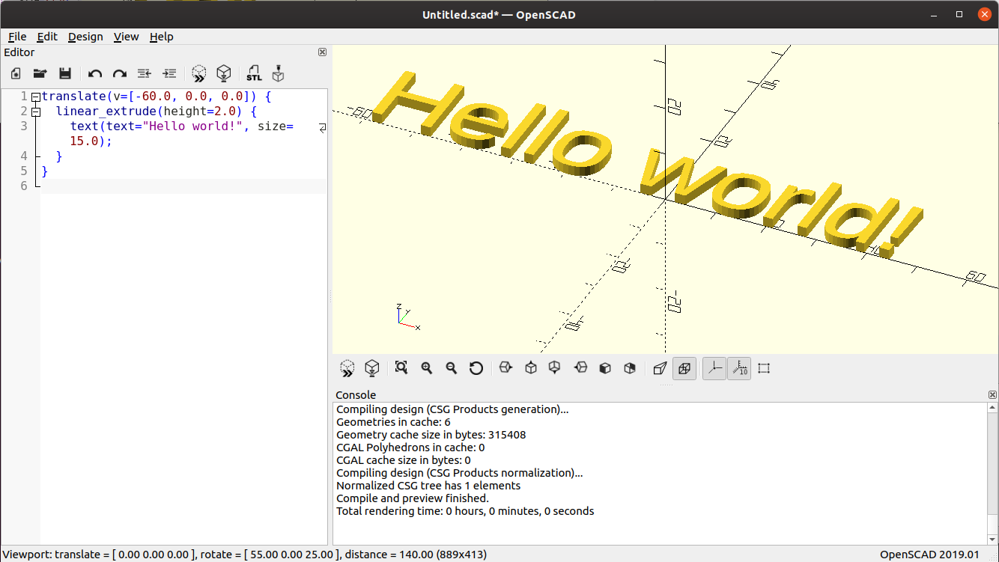

# README #

PythonOpenScad (POSC)

# Introduction

PythonOpenScad is yet another [OpenSCAD](https://www.openscad.org/) script/model generator with Python syntax.

The Python code below, to generate a solid model of text saying ‘Hello world!’, uses the same style as [OpenPyScad](https://github.com/taxpon/openpyscad) API and in fact, apart from the import line, should execute as expected using [OpenPyScad](https://github.com/taxpon/openpyscad).

-----
	from pythonopenscad import Text 
	
	print(|
	  Text('Hello world!', size=15).linear_extrude(height=2)
	      .translate([-60, 0, 0]))
-----

However, as an alternative, [SolidPython](https://github.com/SolidCode/SolidPython) style is also supported, like this.

-----
	from pythonopenscad import text, linear_extrude, translate

	print(
	    translate(v=[-60, 0, 0]) (
	        linear_extrude(height=2) (
	            text(text='Hello world!', size=15)
	        ),
	    )
	)
-----

The generated OpenScad code in both cases above looks like the SolidPython style code with some interesting differences, note the braces ({}) which encapsulates the list of objects that the transforms apply to.

-----
	translate(v=[-60.0, 0.0, 0.0]) {
	  linear_extrude(height=2.0) {
	    text(text="Hello world!", size=15.0);
	  }
	}
-----

Note that OpenScad script above is all using floating point numbers. This is because PythonOpenScad converts all parameters to their corresponding expected type.

If you paste this code into OpenScad you get this:

# Features

The best things come for free. You’re free to use your favourite Python IDE and get all the goodness of a full IDE experience. What doesn’t come for free but is very useful is listed below:

* All POSC constructors are type checked. No generated scripts with junk inside them that’s hard to find where it happened and full debugger support comes for free.

* Supports both [OpenPyScad](https://github.com/taxpon/openpyscad) and [SolidPython](https://github.com/SolidCode/SolidPython) APIs for generating OpenScad code. Some differences exist between them on how the model looks like once it’s done.

* Flexible code dump API to make it easy to add new functionality if desired.

* POSC PyDoc strings have urls to all the implemented primitives. 

* Best of all, it does nothing else. Consider it a communication layer to OpenScad. Other functionality should be built as a different library.

## POSC Compatability with the [OpenPyScad](https://github.com/taxpon/openpyscad) and [SolidPython](https://github.com/SolidCode/SolidPython) APIs

Each POSC object contains member functions for all the OpenScad transformations. (BTW, these functions are simply wrapper functions over the transformation class constructors) This API style is more traditional of solid modelling APIs. However, the POSC implementation gives no preference between either and objects created with one API can be mixed and matched with objects created using the other API. All the [OpenPyScad](https://github.com/taxpon/openpyscad) equivalent classes have capitalized names while the [SolidPython](https://github.com/SolidCode/SolidPython) classes have lower case names (the classes are different but they can be compared for equality). i.e.

<table>
  <tr>
    <td>>>> from pythonopenscad import Text, text
>>> Text() == text()
True
>>> Text('a') == text()
False</td>
  </tr>
</table>

[OpenPyScad](https://github.com/taxpon/openpyscad)’s modifier interface is not implemented. A different PythonOpenScad specific API accomplishes the same function. Modifiers are flags, the PythonOpenScad. There are 4 flags,

DISABLE, SHOW_ONLY, DEBUG and TRANSPARENT. They can be added and removed with the add_modifier, remove_modifier and has_modifiers functions.

## Why Yet Another OpenScad Script Generator?

Using Python to produce solid models using OpenScad seems to be a popular pass time.

Here are some:

[https://github.com/SolidCode/SolidPython](https://github.com/SolidCode/SolidPython) active

[https://github.com/taxpon/openpyscad](https://github.com/taxpon/openpyscad) (kind of active)

[https://github.com/SquirrelCZE/pycad/](https://github.com/SquirrelCZE/pycad/) (gone)

[https://github.com/vishnubob/pyscad](https://github.com/vishnubob/pyscad) (2016)

[https://github.com/bjbsquared/SolidPy](https://github.com/bjbsquared/SolidPy) (2012)

[https://github.com/acrobotic/py2scad](https://github.com/acrobotic/py2scad) (2015)

[https://github.com/TheZoq2/py-scad](https://github.com/TheZoq2/py-scad) (2015)

[https://github.com/defnull/pyscad](https://github.com/defnull/pyscad) (2014)

It seems like lots of dead projects but a popular theme nonetheless.

Given there are 2 active projects the big difference seems to be the API. [SolidPython](https://github.com/SolidCode/SolidPython) seems to mimic OpenScad like syntax (e,g, translate(v)cube()) while [OpenPyScad](https://github.com/taxpon/openpyscad) employs a more common syntax (e.g. cube().translate()).

[SolidPython](https://github.com/SolidCode/SolidPython) appears to be much more active than [OpenPyScad](https://github.com/taxpon/openpyscad) and contains a number of interesting enhancements with the inclusion of "holes". This can be positive or negative, I think negative. Personally I’d prefer another totally separate API layer that has much richer support and distances itself from the OpenScad api entirely.

So why did I write PythonOpenScad? I really don’t like the OpenScad syntax and I wanted a bit more error checking and flexibility with the supported data types. [OpenPyScad](https://github.com/taxpon/openpyscad) could be a whole lot better and it seems like it needs a bit of a rewrite. It still supports Python 2 (and 3) but I wanted to move on.

PythonOpenScad is yet another OpenScad script generator (and only this). I will only entertain features that are specific to supporting OpenScad compatibility in PythonOpenScad . PythonOpenScad supports both the [SolidPython](https://github.com/SolidCode/SolidPython) and [OpenPyScad](https://github.com/taxpon/openpyscad) solid modelling API. (i.e. all the OpenScad transforms, 3D and 2D shapes etc are supported.

* Parameters are checked or converted and will raise exceptions if parameters are incompatible.

* OpenScad defaults are applied so getting attribute values will result in actual values.

* Documentation links to OpenScad reference docs can be found from help(object).

* $fn/$fa/$fs is supported everywhere it actually does something even though the docs don’t say that they do.

* repr(object) works and produces python code. similarly str(object) produces OpenScadCode.

PythonOpenScad code is very specifically only a layer to generate OpenScad scripts. I want to allow for one day where I will write bindings directly to a native OpenScad Python module that will allow more interesting interactions with the model. That’s for another day.

I have/am building another solid modelling tool, ParamertricSolids which allows building libraries of geometric solid models that will hopefully be a much easier way to build complex models. This is a layer on top of other CSG modules that hopefully will have a very independent relationship with OpenScad.